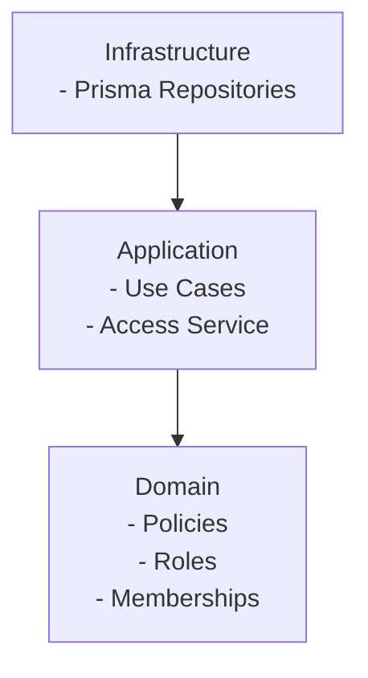

# レイヤ構成と責務

## 目的
本ドキュメントは、DDD に基づくレイヤ構成と責務分担を明確にする。

## レイヤ構成
- Domain（ドメイン）
  - 不変条件・ポリシー・値オブジェクトなどの純粋ロジック
  - 外部依存を持たない
- Application（アプリケーション）
  - ユースケース実行（トランザクション境界を含む）
  - ドメインロジックを組み合わせる
- Infrastructure（インフラ）
  - DB や外部サービスとの接続
  - リポジトリ実装（取得/永続化のみ）

## 依存関係
- Domain は他層に依存しない
- Application は Domain に依存する
- Infrastructure は Application のポートに依存する

## 構成図（概念）

## 現状の配置例
- Domain
  - `server/domain/services/authz/roles.ts`
  - `server/domain/services/authz/policies.ts`
  - `server/domain/services/authz/memberships.ts`
- Application
  - `server/application/authz/access-service.ts`
- Infrastructure
  - `server/infrastructure/repository/authz/prisma-authz-repository.ts`

## 注意点
- リポジトリは「ルールの判断」を行わない
- ドメインロジックは I/O を持たない
- ルールに依存する更新はアプリケーション層でトランザクションを張る

## 認可の実装ルール
- API 層は `getSessionUserId()` でアクターを取得し、アクター ID はリクエストボディで受け取らない
- 認可判定は Application Service 内で行い、`accessService` を必ず経由する
- 存在チェックは Application Service が担当し、見つからない場合は `"* not found"` を返す
- 認可失敗は `"Forbidden"` を返し、API 層は `handleError` に委譲する
- Repository / Mapper は認可判定を持たない
- 具体的な許可/不許可の判断基準は `docs/design/04_access_policy.md` を唯一の参照とする
