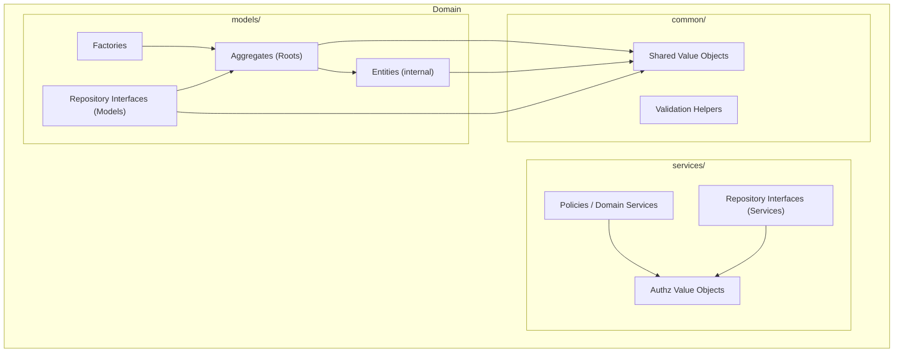
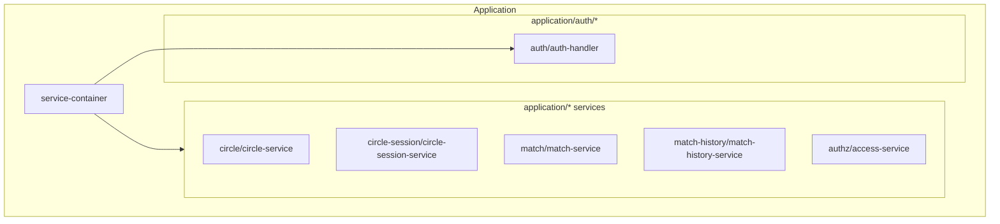

# アーキテクチャ詳細

## 目的
アーキテクチャ概要図を前提に、各レイヤの構成要素を具体名で整理する。
詳細設計に進む際の参照点とする。

## Domain

### Domain Diagram

### models/

#### Aggregates (Roots)
- Circle: `server/domain/models/circle/circle.ts`
- CircleSession: `server/domain/models/circle-session/circle-session.ts`
- Match: `server/domain/models/match/match.ts`
- MatchHistory: `server/domain/models/match-history/match-history.ts`

#### Entities (集約内部)
- CircleParticipant: `server/domain/models/circle/circle-participant.ts`

#### Factories
- Circle: `server/domain/models/circle/circle.ts`
  - createCircle
- CircleSession: `server/domain/models/circle-session/circle-session.ts`
  - createCircleSession
- Match: `server/domain/models/match/match.ts`
  - createMatch / restoreMatch
- MatchHistory: `server/domain/models/match-history/match-history.ts`
  - createMatchHistory

#### Repository Interfaces (Models)
- CircleRepository: `server/domain/models/circle/circle-repository.ts`
- CircleParticipationRepository: `server/domain/models/circle/circle-participation-repository.ts`
- CircleSessionRepository: `server/domain/models/circle-session/circle-session-repository.ts`
- CircleSessionParticipationRepository: `server/domain/models/circle-session/circle-session-participation-repository.ts`
- MatchRepository: `server/domain/models/match/match-repository.ts`
- MatchHistoryRepository: `server/domain/models/match-history/match-history-repository.ts`

### services/

#### Authz Value Objects
- Roles: `server/domain/services/authz/roles.ts`
  - CircleRole / CircleSessionRole
- Memberships: `server/domain/services/authz/memberships.ts`
  - CircleMembership / CircleSessionMembership

#### Policies / Domain Services
- Authz policies: `server/domain/services/authz/policies.ts`
  - 認可判定のポリシー群
- Role comparison: `server/domain/services/authz/roles.ts`
  - isSameOrHigherCircleRole / isSameOrHigherCircleSessionRole
- Ownership invariants: `server/domain/services/authz/ownership.ts`
  - Owner 一意性・移譲時のロール遷移
- CircleSession participation rules: `server/domain/services/circle-session/participation.ts`
  - 対局結果に登場した参加者は取消不可

#### Repository Interfaces (Services)
- AuthzRepository: `server/domain/services/authz/authz-repository.ts`

### common/

#### Value Objects (Shared)
- IDs: `server/domain/common/ids.ts`
  - UserId / CircleId / CircleSessionId / MatchId / MatchHistoryId

#### Validation
- Common validation helpers: `server/domain/common/validation.ts`
  - assertNonEmpty / assertPositiveInteger / assertValidDate / assertStartBeforeEnd / assertDifferentIds

## Application

### Application Diagram

### Application Services
- Circle: `server/application/circle/circle-service.ts`
- Circle Participation: `server/application/circle/circle-participation-service.ts`
- CircleSession: `server/application/circle-session/circle-session-service.ts`
- CircleSession Participation: `server/application/circle-session/circle-session-participation-service.ts`
- Match: `server/application/match/match-service.ts`
- MatchHistory: `server/application/match-history/match-history-service.ts`
- Authz: `server/application/authz/access-service.ts`
- Auth handler (facade): `server/application/auth/auth-handler.ts`

### Composition Root
- Service container: `server/application/service-container.ts`

## Infrastructure

### Infrastructure Diagram

```mermaid
graph TD
  subgraph Infrastructure["Infrastructure"]
    subgraph RepoLayer["repository/*"]
      CircleRepo["circle/prisma-circle-repository"]
      CircleSessionRepo["circle-session/prisma-circle-session-repository"]
      CircleSessionParticipationRepo["circle-session/prisma-circle-session-participation-repository"]
      MatchRepo["match/prisma-match-repository"]
      MatchHistoryRepo["match-history/prisma-match-history-repository"]
      AuthzRepo["authz/prisma-authz-repository"]
    end
    subgraph MapperLayer["mappers/*"]
      CircleMapper["circle-mapper"]
      CircleSessionMapper["circle-session-mapper"]
      CircleSessionParticipationMapper["circle-session-participation-mapper"]
      MatchMapper["match-mapper"]
      MatchHistoryMapper["match-history-mapper"]
      AuthzMapper["authz-mapper"]
    end
    subgraph AuthIntegration["auth/*"]
      NextAuthHandler["nextauth-handler"]
    end
    DBClient["DB Client (server/infrastructure/db.ts)"]
    DB[(Database)]
  end

  RepoLayer --> MapperLayer
  MapperLayer --> DBClient
  DBClient --> DB
```

### Repositories
- Circle: `server/infrastructure/repository/circle/prisma-circle-repository.ts`
- Circle Participation: `server/infrastructure/repository/circle/prisma-circle-participation-repository.ts`
- CircleSession: `server/infrastructure/repository/circle-session/prisma-circle-session-repository.ts`
- CircleSessionParticipation: `server/infrastructure/repository/circle-session/prisma-circle-session-participation-repository.ts`
- Match: `server/infrastructure/repository/match/prisma-match-repository.ts`
- MatchHistory: `server/infrastructure/repository/match-history/prisma-match-history-repository.ts`
- Authz: `server/infrastructure/repository/authz/prisma-authz-repository.ts`

### Mappers
- Circle: `server/infrastructure/mappers/circle-mapper.ts`
- Circle Participation: `server/infrastructure/mappers/circle-participation-mapper.ts`
- CircleSession: `server/infrastructure/mappers/circle-session-mapper.ts`
- CircleSessionParticipation: `server/infrastructure/mappers/circle-session-participation-mapper.ts`
- Match: `server/infrastructure/mappers/match-mapper.ts`
- MatchHistory: `server/infrastructure/mappers/match-history-mapper.ts`
- Authz: `server/infrastructure/mappers/authz-mapper.ts`

### Auth Integration
- NextAuth handler: `server/infrastructure/auth/nextauth-handler.ts`

### DB Client
- Prisma client: `server/infrastructure/db.ts`
